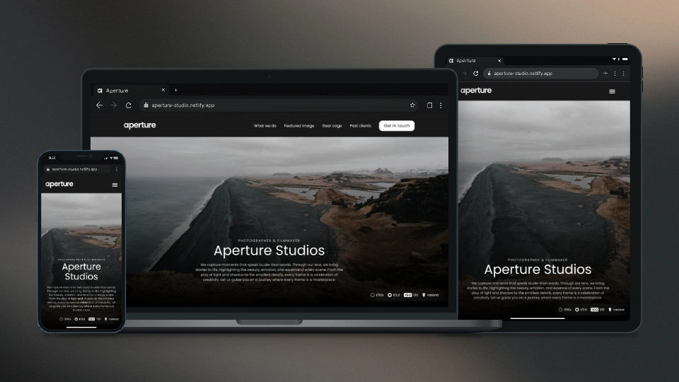

# Aperture Studio

> Welcome to Aperture Studio! This project is a fully responsive website for a creative photography studio, showcasing portfolio work, client collaborations, and providing an engaging user experience.



## Description

**Aperture Studio** is a modern photography portfolio website, created entirely from scratch without any third-party libraries or frameworks. It features fully custom and reusable components for all key UI effects: a hand-built slider, a modular modal system with class inheritance, semantic, fluid and accessible markup, responsive hero video, lazy and adaptive image loading, Intersection Observer for element tracking, smooth text animations and parallax effects. The project's purpose was to dive deep into developing each detail by hand to practice and refine implementation while optimizing performance and user experience.

## Key Features

- **Custom Slider System** - Reusable slider component powering client logos carousel and other image galleries, built entirely from scratch
- **Modal System Architecture** - Modal windows implemented using class inheritance patterns, with reusable base Modal class and specialized implementations
- **Parallax Effects** - Custom parallax implementation with configurable coefficients, smooth animations, and performance optimization
- **Performance Optimization** - Lazy loading, adaptive image and video delivery for different screen densities, Intersection Observer for efficient effect triggering, and debounced event handlers for smooth performance.
- **Custom Scroll Animations** - Beautiful text animations that trigger when scrolling, including blur-out effects and split-text animations with configurable timing
- **Interactive Header** - Smart header that hides and shows based on scroll direction, with smooth transitions and mobile menu integration
- **Contact Forms** - Interactive feedback forms with custom validation, AJAX submission handling, and user experience enhancements
- **Mobile-First Design** - Responsive design approach starting from mobile devices, with adaptive layouts for all screen sizes
- **Semantic HTML5 Markup** - Proper document structure using semantic elements with logical heading hierarchy
- **BEM Methodology** - Consistent CSS architecture following Block Element Modifier principles for maintainable and scalable styling
- **Accessibility Features** - Accessible for all users: keyboard navigation, screen reader support, and basic ARIA attributes.

## Technology Stack

### **Frontend Technologies**

- **HTML5** - Semantic markup with custom components
- **SCSS & CSS3** - Advanced CSS preprocessing with custom mixins, modern CSS features, and animations
- **JavaScript (ES6+)** - Pure JS implementation, no frameworks

### **Build Tools**

- **Vite** - Lightning-fast build tool and dev server
- **PostCSS** - CSS processing and optimization
- **ESLint** - Code quality and consistency

## Getting Started

To run this project locally, you need to have `node` and `npm` installed.

1. Clone the repository:

   ```bash
   git clone https://github.com/yurii-corssa/aperture.git
   ```

2. Install the dependencies:

   ```bash
   npm install
   ```

3. Run the project:

   ```bash
   npm run dev
   ```

## Contributing

Contributions are welcome! Feel free to create a pull request to suggest improvements or new features.

## License

This project is open source and available under the [MIT License](LICENSE).
